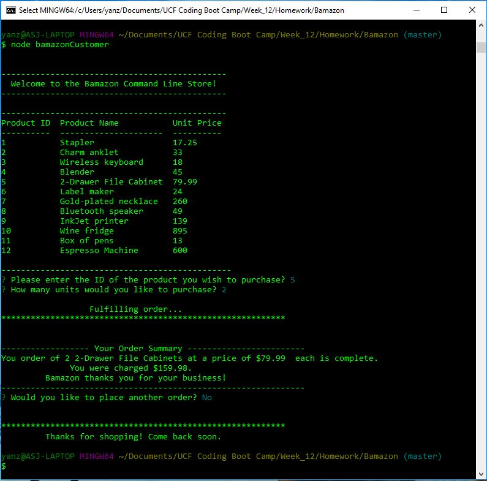

# Bamazon Command Line Interface App

This Bamazon App is an invetory app developed to practice the integration of SQL databases with javascript. It makes use of the mysql NPM package to make select and update queries of a previously created database housing the inventory of an online retail store.

Other NPM packages utlised include 'Console-table' to handily display the table array of objects with minimal required formatting, and 'Inquirer' to prompt for and validate user input.

Below is a screenshot of the running app:

[Click here for a video demonstration](BamazonCustomerDemo.mp4).

